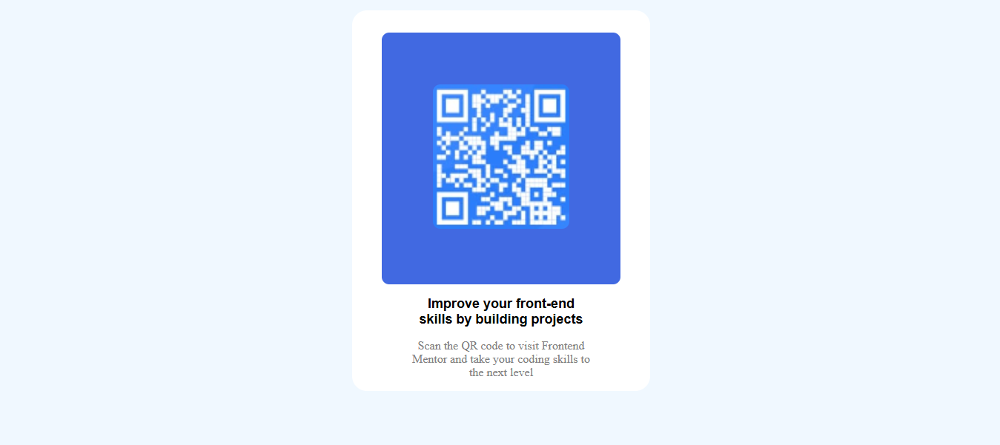
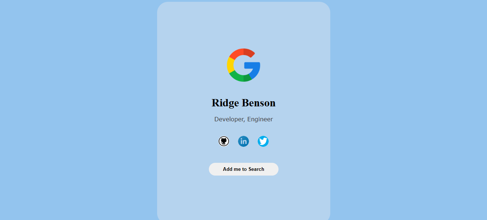

## 🎙️ Mic check, mic check, is this thing on?
This repo is a HTML and CSS practice repo. I decided to learn HTML and CSS from scratch 😁 Ask me how it went 😂 
### What's in here
First things first, HTML pages may look simple in design, but wait till you have to design a page from just an image 😢  
#### Let's roll this thing
First is a QR code page  

Second is a digital business card  

Third is an ecommerce order page  

Fourth design is a remote work opportinuties page  

Fifth is a Testimonials Page using grid  
  
And finally it's Friday 🥳, sorry I have to go 🏃‍♂️‍➡️ 
